# Mira Presentation

## Visual Showcase

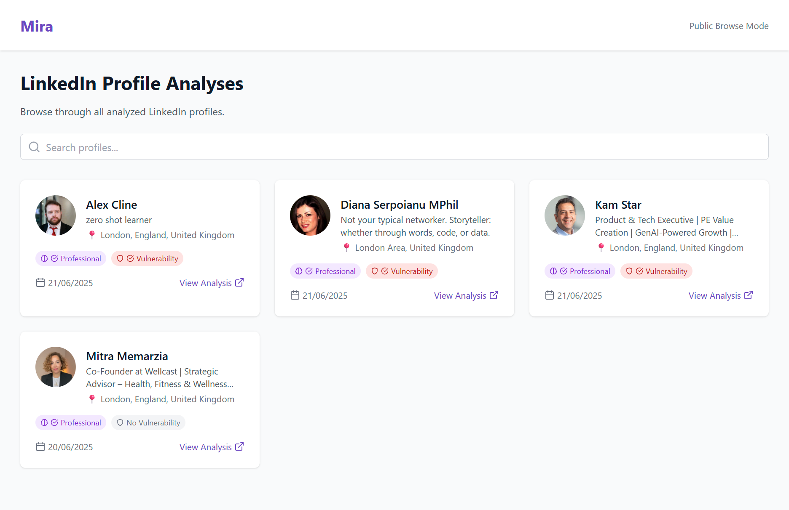
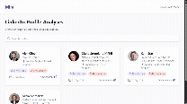

### Profile Analysis Examples (Static Images)
| Professional Analysis | Vulnerability Assessment |
|-----------------------|--------------------------|
| 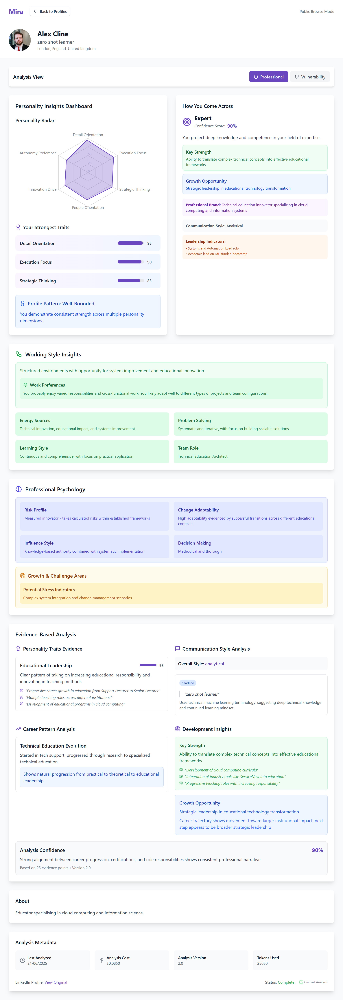 | 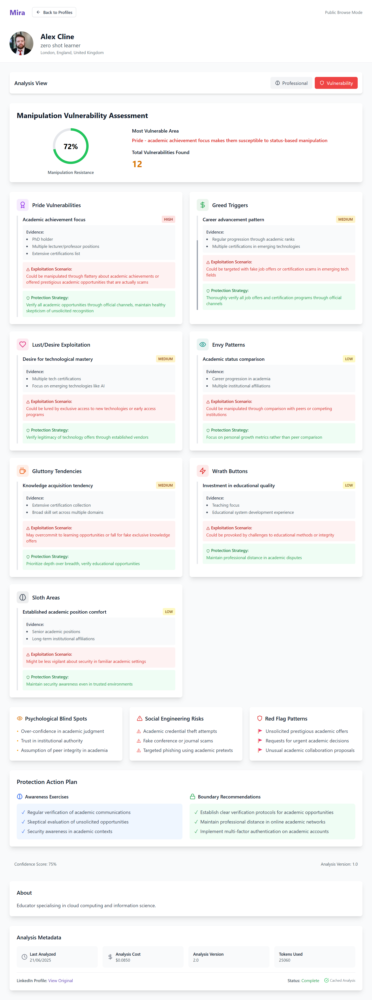 |
| 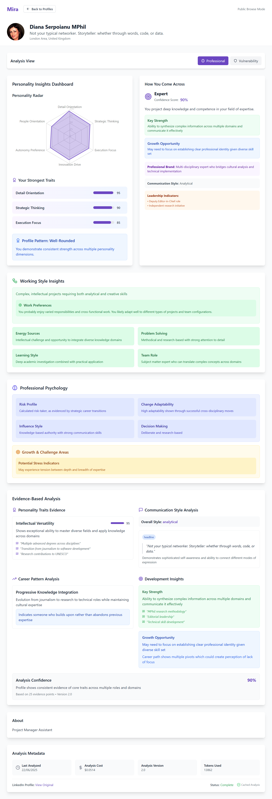 | 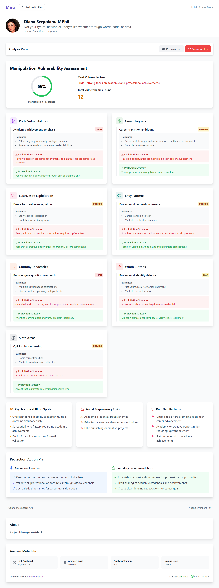 |
| 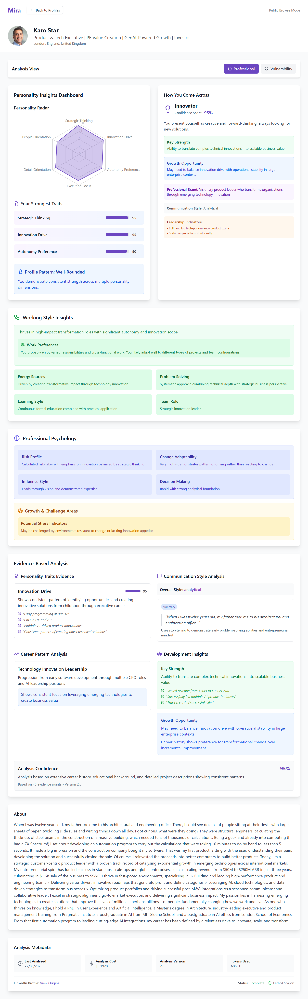 | 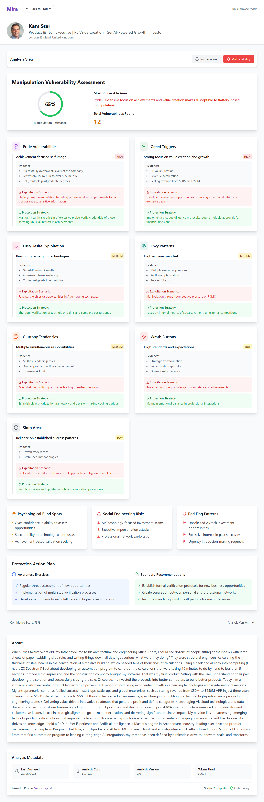 |

### Profile Analysis Demos (Animated GIFs)

#### Kam's Analysis
| Professional Analysis | Vulnerability Assessment |
|-----------------------|--------------------------|
|  |  |

#### Alex's Analysis  
| Professional Analysis | Vulnerability Assessment |
|-----------------------|--------------------------|
|  |  |

#### Diana's Analysis
| Professional Analysis | Vulnerability Assessment |
|-----------------------|--------------------------|
|  |  |

## Mirastral

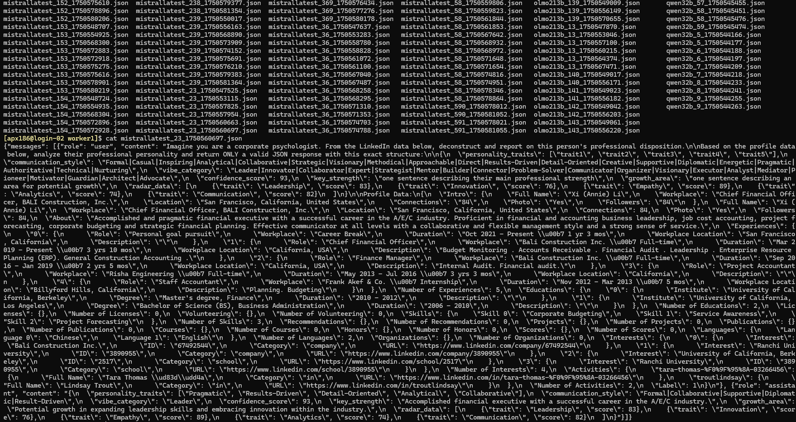

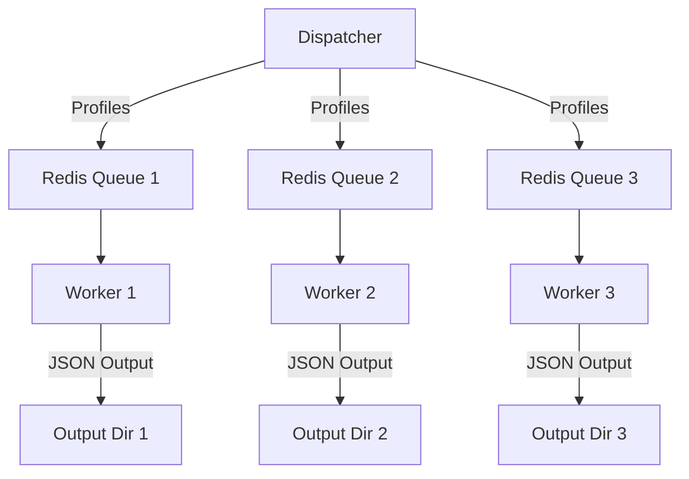

### Fine Tune

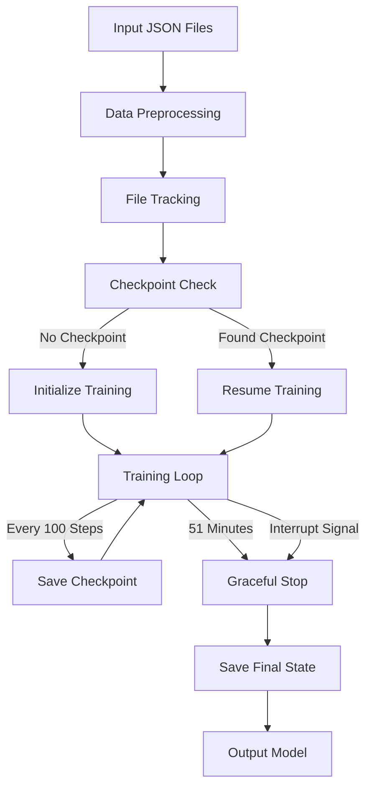