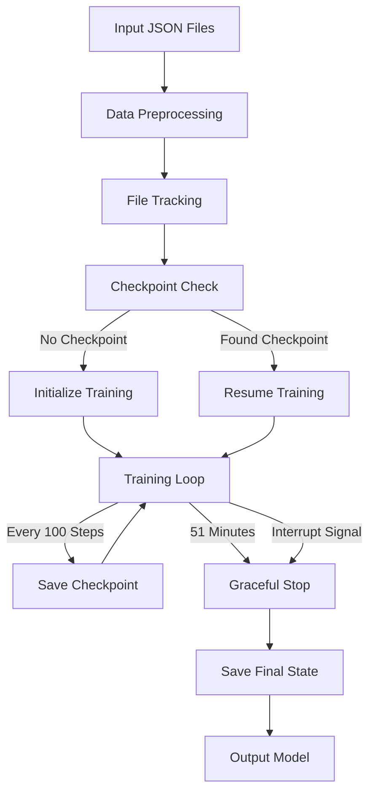

# MiraStral: Fine-tuned Mistral for Therapeutic Conversations

This project fine-tunes the Mistral-7B-Instruct model to create MiraStral, a specialized model for therapeutic conversations and personal profiling. By incorporating tool use and maintaining empathetic responses, MiraStral aims to provide more effective and contextually aware therapeutic interactions.

## Project Overview

MiraStral enhances the base Mistral model by training it on high-quality therapeutic conversations that demonstrate:
- Tool-augmented responses
- Empathetic understanding
- Structured therapeutic techniques
- Safe and ethical interaction patterns

## Process Flow



## Detailed Process Breakdown

### 1. Data Management
- **Input Processing**: Handles JSON files from worker1, worker2, and worker3 directories
- **File Tracking**: 
  - Maintains a record of processed files in `processed_files.pkl`
  - Prevents reprocessing of previously used data
  - Enables incremental training on new data

### 2. Checkpoint System
- **Location**: All checkpoints stored in `/data/scratch/$USER/mira_finetune/`
- **Types of Checkpoints**:
  - Regular checkpoints every 100 steps
  - Interruption checkpoint when stopped
  - Final model state upon completion
- **Auto-Resume**: Automatically detects and resumes from latest checkpoint

### 3. Time Management
- **Duration Control**: 
  - Maximum runtime of 51 minutes
  - Graceful shutdown procedure
  - Preserves progress and state
- **Signal Handling**:
  - Catches interruption signals
  - Ensures clean shutdown
  - Saves progress before exit

### 4. Training Process
- **Initialization**:
  - Model setup with 4-bit quantization
  - LoRA configuration
  - Tokenizer preparation
- **Training Loop**:
  - Gradient accumulation
  - Regular checkpointing
  - Progress monitoring
- **Output**:
  - Saved model weights
  - Training logs
  - Performance metrics

## Project Structure

```
fine_tune/
├── main.py              # Main fine-tuning script with timing control
├── fine_tune.py         # Model configuration
├── reformat_data.py     # Data preprocessing
├── run_finetune.sh      # HPC job script
└── requirements.txt     # Dependencies
```

## Output Structure

The fine-tuned model and training artifacts are saved in:
```
/data/scratch/$USER/mira_finetune/
├── results/            # Training checkpoints and logs
├── final_model/        # Final fine-tuned model
└── processed_files.pkl # Record of processed files
```

## Therapeutic Applications

MiraStral is designed to enhance therapeutic interactions by:

1. **Contextual Understanding**
   - Recognizes therapeutic contexts
   - Maintains conversation history awareness
   - Adapts responses to client needs

2. **Tool-Enhanced Support**
   - Integrates external resources seamlessly
   - Maintains therapeutic flow during tool use
   - Provides structured interventions when appropriate

3. **Safety and Ethics**
   - Recognizes crisis situations
   - Maintains appropriate boundaries
   - Provides clear disclaimers about AI limitations

4. **Therapeutic Techniques**
   - Implements active listening
   - Uses reflection and validation
   - Maintains therapeutic alliance

## Running the Fine-tuning

1. Install dependencies:
```bash
pip install -r requirements.txt
```

2. Submit the HPC job:
```bash
qsub run_finetune.sh
```

### Training Continuation
- If the job is interrupted, it will automatically resume from the latest checkpoint
- New data files will be automatically included in subsequent training runs
- Progress is tracked and saved every 100 steps

## Important Notes

- This model is intended as a research tool and therapeutic aid, not a replacement for human therapists
- All interactions should be monitored and supervised by qualified professionals
- Regular evaluation of model outputs for safety and effectiveness is essential
- Training is automatically managed in 51-minute segments with state preservation

## Future Directions

- Integration with more specialized therapeutic tools
- Expansion of training data to cover more therapeutic approaches
- Development of evaluation metrics for therapeutic effectiveness
- Enhanced safety monitoring and intervention protocols

## Acknowledgments

This project builds on the excellent work of:
- Mistral AI team for the base model
- The therapeutic community for conversation data
- HuggingFace for training infrastructure 