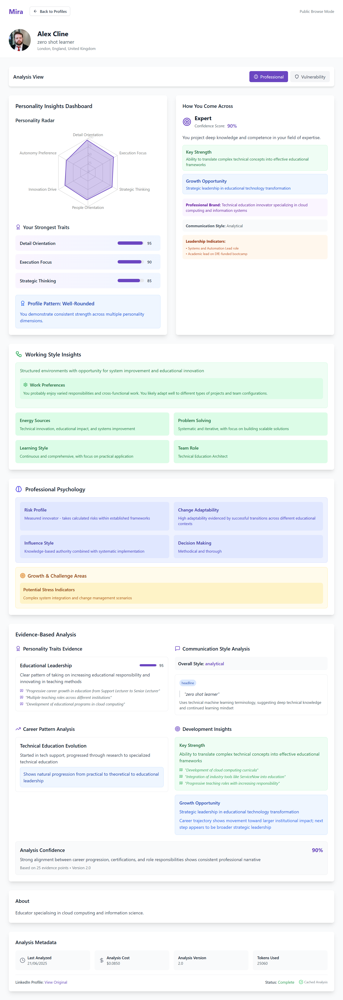
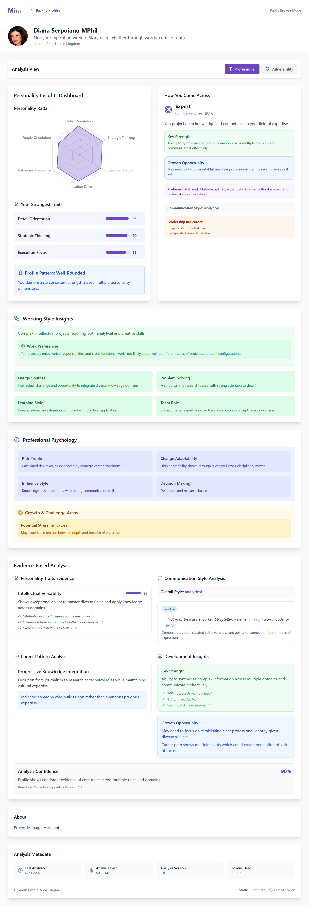

<!-- .slide: data-background="assets/mira-bg.png" data-background-size="cover" -->

<h1 style="color: #6a0dad; -webkit-text-stroke: 2px white; text-stroke: 2px white;">Mira</h1>

<h3 style="color: #6a0dad; -webkit-text-stroke: 1px white; text-stroke: 1px white;">What's your</h3><h3 style="color: #6a0dad; -webkit-text-stroke: 1px white; font-style: italic;  font-size: 100px;">𝔳𝔦𝔟𝔢</h3><h3 style="color: #6a0dad; -webkit-text-stroke: 1px white; text-stroke: 1px white;">?</h3>

Note: Welcome to Mira's technical showcase

### 🏆 Hackathon Achievement
- Built full-stack prototype in 24 hours
- Integrated Supabase, RapidAPI, and Claude AI
- Developed novel three-model AI architecture

   

      

        <section data-markdown="slides.md" data-background-image="assets/runthrough-interface-.gif"></section>
      

    

Note: We delivered a complete MVP within the tight timeframe

### 🧠 Core Innovation
- First fine-tuned Mistral for therapeutic use
- Evidence-based personality analysis
- Seven Deadly Sins vulnerability assessment

Note: Our technical approach is fundamentally unique

### ⚡ Technical Highlights
- 70-80% cost reduction via smart caching
- Distributed Redis queue processing
- 1.4M psychology text chunks for training

Note: Practical yet innovative technical solutions

### 🔍 Analysis Engine

- Professional personality insights
- Communication style assessment
- Vibe categorization

<!-- Remove the inline image since it's now the background -->

Note: Goes beyond generic personality tests

### 🛡️ Security & Privacy
- Row Level Security implementation
- Encrypted feedback system
- Ethical data practices

Note: We take privacy seriously

### 📊 Data Processing
- Processed 1,478 psychology books
- Stored 1.4M text chunks in Redis
- Distributed across multiple LLMs

Note: Robust and scalable data pipeline

### Profile Analysis Examples
| <small>Professional</small> | <small>Vulnerability</small> |
|--------------|---------------|
|  |  |
|  |  |
|  |  |

Note: Real examples of our analysis output

### 🚀 Full Implementation
- Astro + React frontend
- Supabase backend
- RapidAPI integration
- Claude 3.5 analysis

Note: Complete, production-ready stack

### 🌟 Unique Value
- Combines self-perception, social media, and feedback
- Specialized therapeutic fine-tuning
- Personal model that evolves

Note: Truly unique in personal development

### 🎯 Next Steps
- Expand social platform integration
- Enhance feedback system
- Develop mobile AR features

Note: We're just getting started
